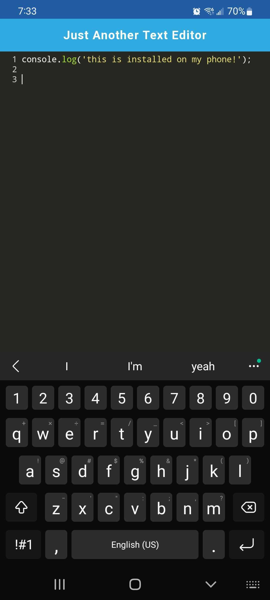

# Text Editor

Just Another Text Editor is a lightweight text editor that you can take with you anywhere. It works both online and offline on a desktop or mobile device.

## Instalation

You can clone this repo to a local repository. You will run npm install at the root directory and then run npm start dev.

## Usage

To use the application, go to https://andrearene-jate-app.herokuapp.com/ and start making your notes! You can also install the app to your desktop/mobile device using the Install! button.

## Technologies and Rescources used 
* HTML
* CSS
* JavaScript
* Webpack
* idb
* Babel
* Express
* Workbox

# A look at the app

## App Installed on Mobile

